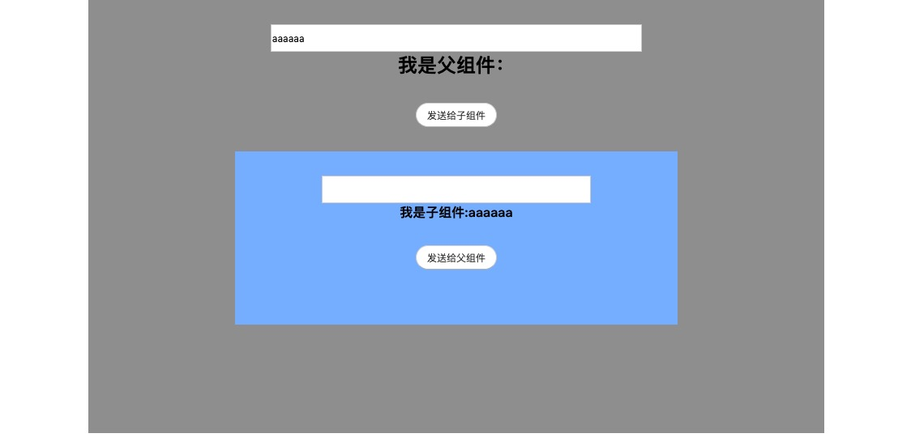
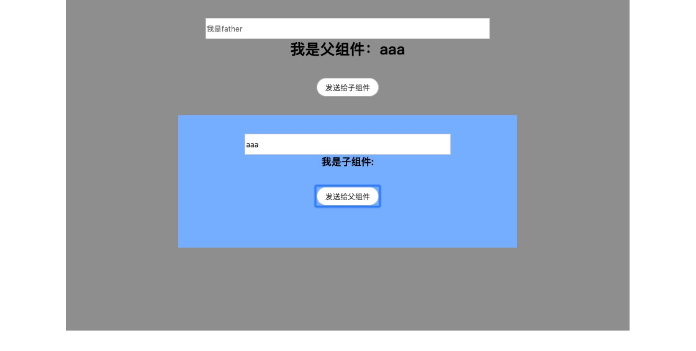

## JS框架学习

### Vue.js

#### 安装

```shell
npm install -g vue-cli

vue init webpack projectName
cd projectName
npm run dev
```


#### 基础知识

##### 生命周期


由上图我们可以看出：在vue中有八个生命周期的钩子，它们分别是：

1. beforeCreate
2. create
3. beforeMount
4. mounted
5. beforeUpdate
6. updated
7. beforeDestroy
8. destroyed

那么它们之中最重要的就是第四个，mounted，它所代表的是对象挂载之后的这么一个生命周期，相当于原生js中loaded，就是在dom节点挂载之后，开始渲染页面之前的这么一个生命周期，比如我们的ajax请求大部分可能就要在这里来进行


#### 选项数据

* data
* computed
* methods

首先data属性是管理全局变量的一个对象，在html标签中，要使用它其中的变量只需要`{{ 变量名即可 }}`,我们可以把它想做对象的解构赋值，而且在这个`{{}}`中我们可以输入js表达式，但是要注意的是这里使用的两层花括号；

computed和methods是两个对象，我们在模板主要使用他们的方法，所以在书写的时候data是函数形式，而他们两个则是对象

```vue
<template>
    <div>
      <h1>选项数据</h1>
      <h1>---------------------------</h1>
      <h1>data: {{ message }}</h1>
      <h1>---------------------------</h1>
      <h1>computed:  {{ count }}</h1>
      <h1>---------------------------</h1>
      <h1 @click="sayHi('hello')">methods!</h1>
    </div>
</template>

<script>
  export default {
    name: "test",
    data() {
      return {
        message: '我是李松蔚',
        num: 20
      }
    },
    computed: {
      count() {
        return this.num + 10;
      }
    },
    methods: {
      sayHi(params) {
        alert(params)
      }
    }
  }
</script>
```

#### 模板语法

* v-html (类似于原生js的innerHTML)

* v-text (类似于原生js的innerText)

* v-bind (动态绑定标签的属性，简写模式 `:`，只要是元素的属性需要动态绑定的时候都需要v-bind)

* v-on (事件监听，简写模式`@`,有时候事件，需要组织默认行为或者组织事件冒泡，这个时候我们只需要在事件后面加上`.`修饰符即可)

  ```vue
  <button id="btn" v-on:click.prevent="handle"></button> // 阻止默认行为
  <button id="btn" v-on:click.stop="handle"></button> // 阻止事件冒泡
  ```

* v-model 在表单上建立数据的双向绑定，使用该标签后元素的`value, checked, selected`将失效，取而代之是用v-model,所有我们要把表单的数据在data中初始化

  v-model的修饰符

  ```vue
  <input v-model.lazy="msg"> // 数据不会实时更新，当表单失去焦点时更新
  <input v-model.number="msg"> // 输入值转化为数字类型
  <input v-model.trim="msg"> // 过滤输入的首尾空格
  ```

* v-for 主要用于遍历，但是要注意绑定key属性

  ```vue
  v-for="item in items" // 遍历数组
  v-for="(item, index) in items" // 遍历数组，index是索引

  v-for="(key, value) in item" // 遍历对象
  ```

* v-if 条件渲染，通过true和false来控制，使用v-if的时候，若值为false他就不会真实地生成DOM元素，而另外一个条件渲染v-show，在值为false的时候，他还是会生成DOM只是通过css的display属性将其隐藏，但是它还是存在于DOM上的。


##### Vue的组件通信

假设我们现在有两个组件，一个叫`father`一个叫`child`，那么我们怎么实现这两个组件的相互之间的通信呢？

我们先来写两个组件分别是`father.vue`和`child.vue`代码如下

```Vue
// father.vue
<template>
  <div class="father">
    <input
      class="father-input"
      v-model="fatherMessage"
      type="text"
      placeholder="我是father"
    >
    <h2>我是父组件：{{showMessage}}</h2>
    <button>发送给子组件</button>
    <Child :toChild="fatherMessage"></Child>
  </div>
</template>

<script>
  import Child from '@/components/child'
  export default {
    components: {Child},
    name: "father",
    data() {
      return {
        fatherMessage: '',
        showMessage: ''
      }
    }
  }
</script>

<style scoped>
.father{
  width: 80%;
  height: 40vh;
  background-color: #999999;
  display: flex;
  flex-direction: column;
  align-items: center;
}
.father-input{
  margin-top: 30px;
  width: 50%;
  height: 30px;
}
  button{
    margin-top: 30px;
    width: 100px;
    height: 30px;
    line-height: 30px;
    border-radius: 20px;
    margin-bottom: 30px;
  }
</style>
```

```Vue
<template>
  <div class="child">
    <input class="child-input" type="text" v-model="childMessage">
    <h4>我是子组件:{{toChild}}</h4>
    <button>发送给父组件</button>
  </div>
</template>

<script>
  export default {
    name: "child",
    props: ['toChild'],
    data () {
      return {
        childMessage: '',
        showChildMessage: ''
      }
    }
  }
</script>

<style scoped>
.child{
  width: 60%;
  height: 40%;
  background-color: #80b7ff;
  display: flex;
  flex-direction: column;
  align-items: center;
}
  .child-input{
    width: 60%;
    height: 30px;
    margin-top: 30px;
  }
  button{
    margin-top: 30px;
    width: 100px;
    height: 30px;
    line-height: 30px;
    border-radius: 20px;
  }
</style>
```

界面如下



​	当我们在父组件框中输入值的时候，值就会传到子组件的文字部分显示，那么父组件向子组件传值就是通过，父组件给子组件标签绑定属性值，传入数据，然后子组件在props中获得，使用该数据，直接在模板中调用传入的数据即可。


##### 子组件给父组件传值

和React类似，子组件给父组件传值，需要调用父组件的方法

```Vue
// father
<template>
  <div class="father">
    <input
      class="father-input"
      v-model="fatherMessage"
      type="text"
      placeholder="我是father"
    >
    <h2>我是父组件：{{showMessage}}</h2>
    <button>发送给子组件</button>
    <Child
      :toChild="fatherMessage"
      @getChildMessage="getChildMessage"
    ></Child>
  </div>
</template>

<script>
  import Child from '@/components/child'
  export default {
    components: {Child},
    name: "father",
    data() {
      return {
        fatherMessage: '',
        showMessage: ''
      }
    },
    methods: {
      getChildMessage(data) {
        this.showMessage = data
      }
    }
  }
</script>

<style scoped>
.father{
  width: 80%;
  height: 40vh;
  background-color: #999999;
  display: flex;
  flex-direction: column;
  align-items: center;
}
.father-input{
  margin-top: 30px;
  width: 50%;
  height: 30px;
}
  button{
    margin-top: 30px;
    width: 100px;
    height: 30px;
    line-height: 30px;
    border-radius: 20px;
    margin-bottom: 30px;
  }
</style>
```


```Vue
// child
<template>
  <div class="child">
    <input class="child-input" type="text" v-model="childMessage">
    <h4>我是子组件:{{toChild}}</h4>
    <button @click="handleClick">发送给父组件</button>
  </div>
</template>

<script>
  export default {
    name: "child",
    props: ['toChild'],
    data () {
      return {
        childMessage: '',
        showChildMessage: ''
      }
    },
    methods: {
      getMessageToFather(data) {
        this.$emit('getChildMessage', data)
      },
      handleClick() {
        this.getMessageToFather(this.childMessage)
      }
    }
  }
</script>

<style scoped>
.child{
  width: 60%;
  height: 40%;
  background-color: #80b7ff;
  display: flex;
  flex-direction: column;
  align-items: center;
}
  .child-input{
    width: 60%;
    height: 30px;
    margin-top: 30px;
  }
  button{
    margin-top: 30px;
    width: 100px;
    height: 30px;
    line-height: 30px;
    border-radius: 20px;
  }
</style>
```




通过上述代码和图片可知，我们在子组件和父组件通信的时候，首先要在父组件中定义一个方法，然后在子组件的属性中监听这个方法，而在子组件中需要通过

`this.$emit('父组件传来的方法'，参数1，参数2...)`来调用，实际上它是使用了父组件的方法，只是参数是有子组件传进去的，所以我们就可以在父组件中获得子组件的数据了

### React.js

#### 组件之间的通信

其实React组件之间的通信方式和Vue类似，但是在具体方法上面还是有区别

父 => 子

还是和vue差不多，react先在子组件上绑定属性，在子组件中我们通过`this.props.属性名`来获得父组件传入的数据

子 => 父

首先我们需要在父组件中定义一个需要参数的函数，同样想给子组件传数据一样，把这个函数传递给子组件，子组件通过`this.props.函数名`来获得父组件传过来的方法，再在子组件中来调用，传入参数，那么此时就获得了子组件的值，还是相当于子组件调用了父组件的方法并传入了自身的值，所以父组件就能获得到子组件的数据了

但是，在React中，要特别注意`this`的指向，尤其是触发事件的时候，一定要在之前就绑定this的作用域，还有就是要绑定好父组件函数中的`this`和子组件中的`this`